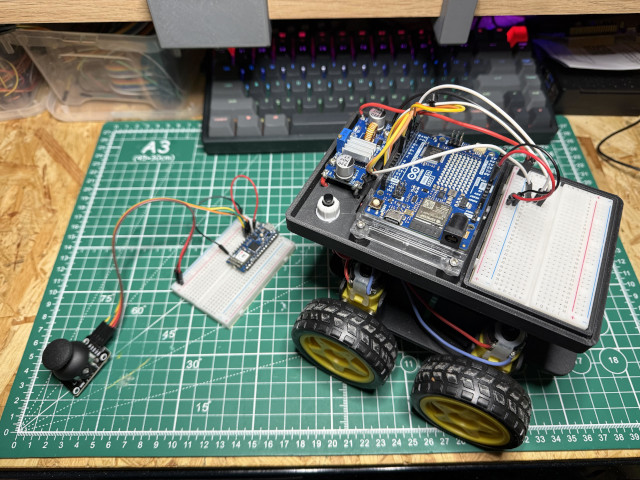

Nothing serious to be seen here! 
This is just my little toy project to create a simple Bluetooth LE operated robocar.

The project uses the following components. For the remote control:

* [Arduino Nano 33 IoT](https://store.arduino.cc/products/arduino-nano-33-iot)
* [Joystick KY023](https://amzn.eu/d/bTYbPiN) (the library can be found [here](https://github.com/pavel-jiranek/Joystick-KY023))

For the car:

* [Arduino Uno R4 WiFi](https://store.arduino.cc/products/uno-r4-wifi)
* [DC buck converter](https://amzn.eu/d/d8TPw8J) to convert 12V to 5V to feed the Arduino board
* [L298N Motor Drive Controller Module](https://amzn.eu/d/ijFPYj8)
* [Small 12V lead acid battery](https://amzn.eu/d/12Gzraq)
* [A couple of DC motors](https://amzn.eu/d/gEyQOlV)